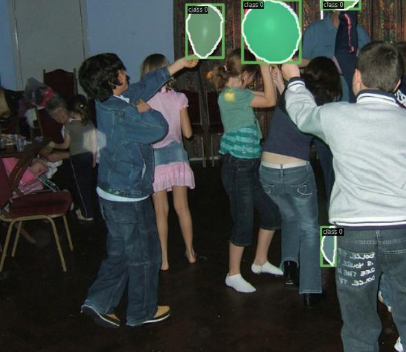
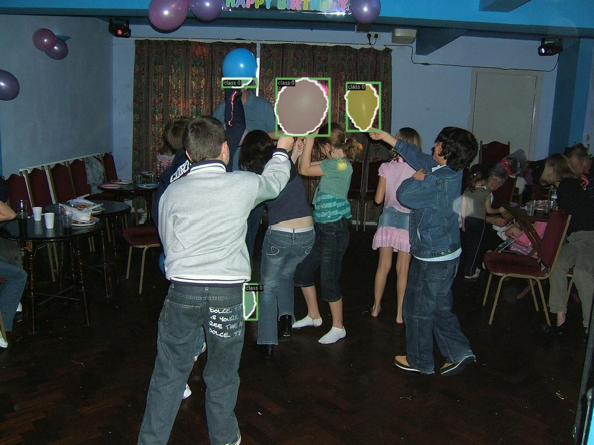
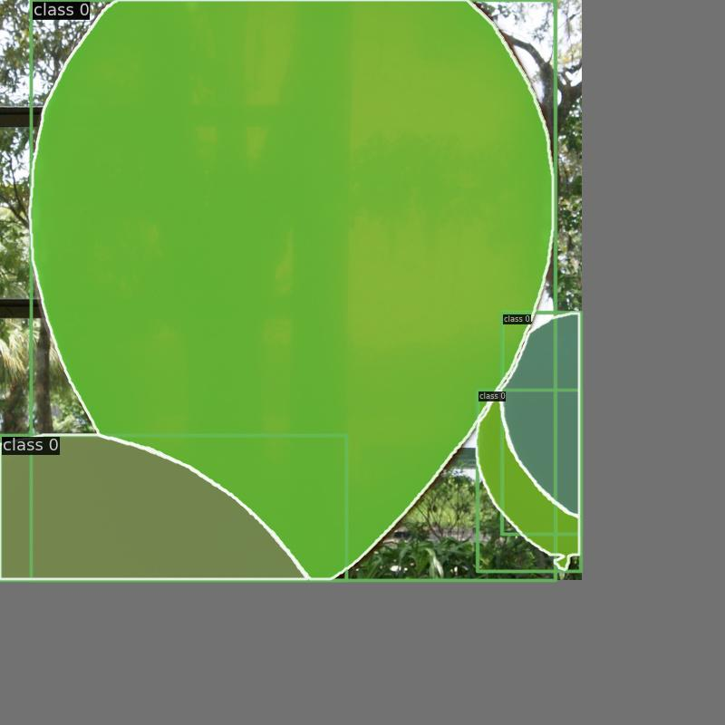
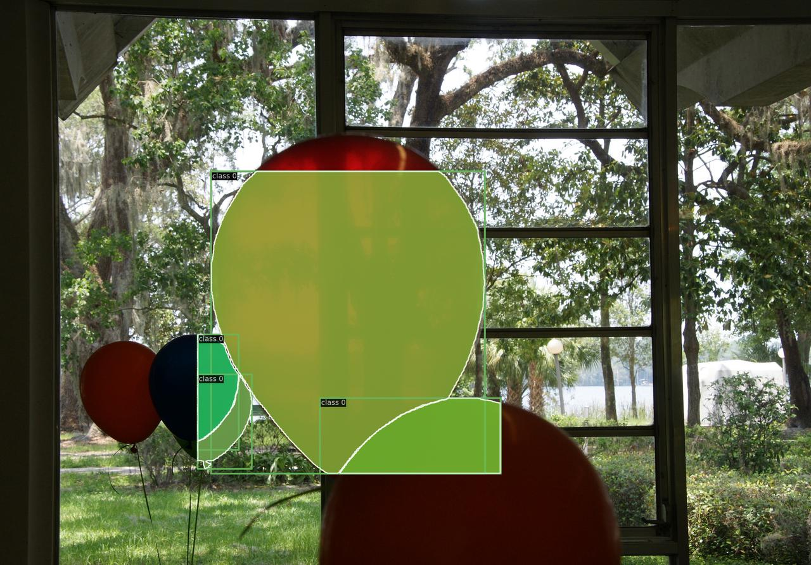
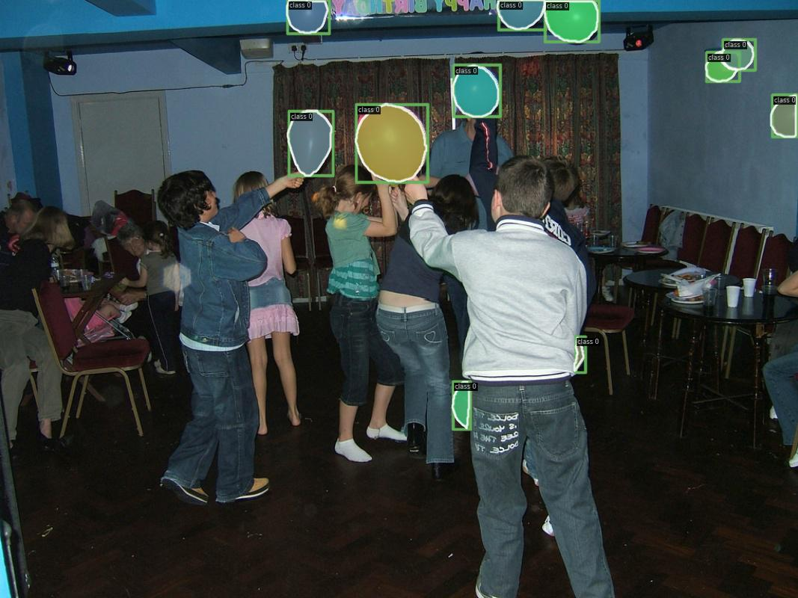
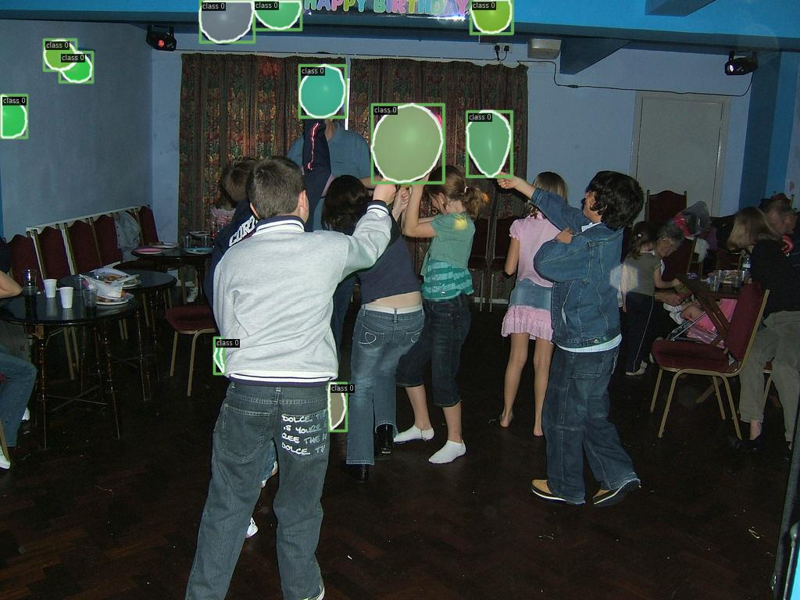

# 数据增强还原设计

## 目前还原效果
### dino_train_pipeline
```python
dino_train_pipeline = [
    dict(type='LoadImageFromFile', backend_args=None),
    dict(type='LoadAnnotations', with_bbox=True, with_mask=True),
    dict(type='RandomFlip', prob=1.0),
    dict(
        type='RandomChoice',
        transforms=[
            [
                dict(
                    type='RandomChoiceResize',
                    scales=[(480, 1333), (512, 1333), (544, 1333), (576, 1333),
                            (608, 1333), (640, 1333), (672, 1333), (704, 1333),
                            (736, 1333), (768, 1333), (800, 1333)],
                    # scales=(480,1333),
                    keep_ratio=True)
            ],
            [
                dict(
                    type='RandomChoiceResize',
                    # The radio of all image in train dataset < 7
                    # follow the original implement
                    scales=[(400, 4200), (500, 4200), (600, 4200)],
                    keep_ratio=True),
                dict(
                    type='RandomCrop',
                    crop_type='absolute_range',
                    crop_size=(384, 600),
                    allow_negative_crop=True),
                dict(
                    type='RandomChoiceResize',
                    scales=[(480, 1333), (512, 1333), (544, 1333), (576, 1333),
                            (608, 1333), (640, 1333), (672, 1333), (704, 1333),
                            (736, 1333), (768, 1333), (800, 1333)],
                    keep_ratio=True)
            ]
        ]),
    dict(type='PackDetInputs',
         meta_keys=('img_id', 'img_path', 'ori_shape', 'img_shape',
                    'scale_factor', 'flip', 'flip_direction', 'crop_index', 'scale_factor_list', 'random_choice_idx',
                    'pre_pad_size', 'pre_crop_size', 'pre_resize_shape_list'
                    )
         )
]
```
数据增强后效果(使用数据集的label、bbox、mask来模拟模型输出的效果)


还原到原图上效果


### trm_det_train_pipeline(CachedMosaic暂未支持)
```python
trm_det_train_pipeline = [
    dict(backend_args=None, type='LoadImageFromFile'),
    dict(type='LoadAnnotations', with_bbox=True, with_mask=True),
    # dict(
    #     type='CachedMosaic',
    #     img_scale=(640, 640),
    #     pad_val=114.0,
    #     max_cached_images=20,
    #     random_pop=False),
    dict(
        type='RandomResize',
        scale=(1280, 1280),
        ratio_range=(0.5, 2.0),
        keep_ratio=True),
    dict(type='RandomCrop', crop_size=(640, 640)),
    dict(type='YOLOXHSVRandomAug'),
    dict(type='RandomFlip', prob=1.0),
    dict(type='Pad', size=(800, 800), pad_val=dict(img=(114, 114, 114))),
    dict(type='PackDetInputs',
         meta_keys=(
             'img_id', 'img_path', 'ori_shape', 'img_shape',
             'scale_factor', 'flip', 'flip_direction', 'crop_index', 'scale_factor_list',
             'pre_pad_size', 'pre_crop_size'
         )
         )
]
```
模拟模型输出结果


还原到原图上效果


### mask_rcnn_train_pipeline 
```python
mask_rcnn_train_pipeline = [
    dict(type='LoadImageFromFile', backend_args=None),
    dict(type='LoadAnnotations', with_bbox=True, with_mask=True),
    dict(type='Resize', scale=(1333, 800), keep_ratio=True),
    dict(type='RandomFlip', prob=1.0),
    dict(type='PackDetInputs',
         meta_keys=('img_id', 'img_path', 'ori_shape', 'img_shape',
                    'scale_factor', 'flip', 'flip_direction', 'crop_index', 'scale_factor_list',
                    'pre_pad_size', 'pre_crop_size'
                    )
         )
]
```
模拟模型输出结果

s
还原到原图上效果
